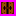
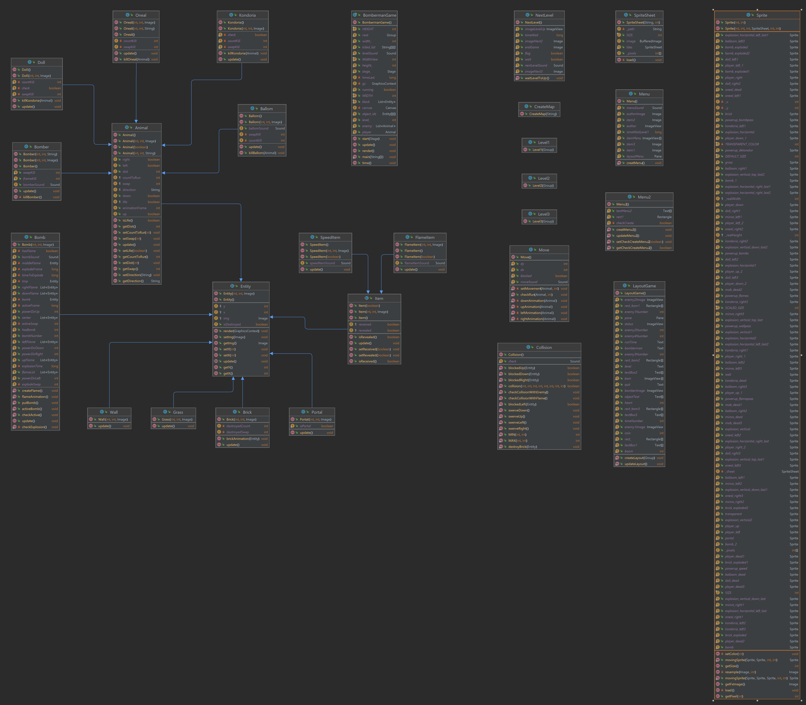

# Bài tập lớn OOP - Bomberman Game

Trong bài tập lớn này, team mình đã viết một phiên bản Java mô phỏng lại trò chơi [Bomberman](https://www.youtube.com/watch?v=mKIOVwqgSXM) kinh điển của NES sử dụng thư viện JavaFX.

Các thành viên của team:
- Trần Tuấn Anh
- Trần Đức Khải

## Mô tả về các đối tượng trong trò chơi
Nếu bạn đã từng chơi Bomberman, bạn sẽ cảm thấy quen thuộc với những đối tượng này. Chúng được được chia làm hai loại chính là nhóm đối tượng động (*Bomber*, *Enemy*, *Bomb*) và nhóm đối tượng tĩnh (*Grass*, *Wall*, *Brick*, *Door*, *Item*).

-  *Bomber* là nhân vật chính của trò chơi. Bomber có thể di chuyển theo 4 hướng trái/phải/lên/xuống theo sự điều khiển của người chơi.
-  *Enemy* là các đối tượng mà Bomber phải tiêu diệt hết để có thể qua Level. Enemy có thể di chuyển ngẫu nhiên hoặc tự đuổi theo Bomber tùy theo loại Enemy. Khi bị tiêu diệt Enemy sẽ sinh ra Coin để Bomber thu thập. Các loại Enemy sẽ được mô tả cụ thể ở phần dưới.
-  *Bomb* là đối tượng mà Bomber sẽ đặt và kích hoạt tại các ô Grass. Khi đã được kích hoạt, Bomber và Enemy không thể di chuyển vào vị trí Bomb. Tuy nhiên ngay khi Bomber vừa đặt và kích hoạt Bomb tại ví trí của mình, Bomber có một lần được đi từ vị trí đặt Bomb ra vị trí bên cạnh. Sau khi kích hoạt 2s, Bomb sẽ tự nổ, các đối tượng *Flame*  được tạo ra.

-  *Grass* là đối tượng mà Bomber và Enemy có thể di chuyển xuyên qua, và cho phép đặt Bomb lên vị trí của nó.
-  *Wall* là đối tượng cố định, không thể phá hủy bằng Bomb cũng như không thể đặt Bomb lên được, Bomber và Enemy không thể di chuyển vào đối tượng này.
-  *Brick* là đối tượng được đặt lên các ô Grass, không cho phép đặt Bomb lên nhưng có thể bị phá hủy bởi Bomb được đặt gần đó. Bomber và Enemy thông thường không thể di chuyển vào vị trí Brick khi nó chưa bị phá hủy.
-  *Portal* là đối tượng sẽ hiện ra sau khi tất cả Enemy đã bị tiêu diệt và người chơi có thể qua Level khác bằng cách di chuyển vào vị trí của Portal.

Các *Item* cũng được giấu phía sau Brick và chỉ hiện ra khi Brick bị phá hủy. Bomber có thể sử dụng Item bằng cách di chuyển vào vị trí của Item. Các Item đã được cài đặt trong game có chức năng như dưới đây:
-  *SpeedItem* Khi sử dụng Item này, Bomber sẽ được tăng vận tốc di chuyển thêm một giá trị thích hợp.
-  *FlameItem* Item này giúp tăng phạm vi ảnh hưởng của Bomb khi nổ (độ dài các Flame lớn hơn).

Có nhiều loại Enemy trong Bomberman, trong phiên bản game này đã cài đặt các loại Enemy sau:
-  *Balloom* là Enemy đơn giản nhất, di chuyển với vận tốc cố định, khi chạm tường sẽ di chuyển ngẫu nhiên theo một hướng khác.
-  *Oneal* có tốc độ di chuyển thay đổi, lúc nhanh, lúc chậm và di chuyển "thông minh" hơn so với Balloom (biết đuổi theo Bomber).
-  *Kondoria* có tốc độ di chuyển cố định, nhưng có thể đi xuyên qua Brick và thỉnh thoảng sẽ ngẫu nhiên quay đầu di chuyển theo hướng ngược lại hướng đang di chuyển.
-  *Doll* có tốc độ di chuyển rất nhanh, nhưng chỉ di chuyển theo chiều dọc (lên xuống) hoặc theo chiều ngang (trái phải), khi chạm tường sẽ có xác suất đổi chiều di chuyển.

## Mô tả game play, xử lý va chạm và xử lý bom nổ
- Di chuyển Bomber bằng các nút mũi tên ↑↓←→ và đặt Bomb bằng nút SPACE.
- Trong một màn chơi, Bomber sẽ được người chơi di chuyển, đặt và kích hoạt Bomb với mục tiêu chính là tiêu diệt tất cả Enemy và tìm ra vị trí Portal để có thể qua màn mới.
- Bomber sẽ bị giết khi va chạm với Enemy hoặc thuộc phạm vi Bomb nổ. Lúc đấy trò chơi kết thúc.
- Enemy bị tiêu diệt khi thuộc phạm vi Bomb nổ.
- Một đối tượng thuộc phạm vi Bomb nổ có nghĩa là đối tượng đó va chạm với một trong các tia lửa được tạo ra tại thời điểm một đối tượng Bomb nổ.

- Khi Bomb nổ, một Flame trung tâm tại vị trí Bomb nổ và bốn Flame tại bốn vị trí ô đơn vị xung quanh vị trí của Bomb xuất hiện theo bốn hướng trên/dưới/trái/phải. Độ dài bốn Flame xung quanh mặc định là 1 đơn vị, được tăng lên khi Bomber sử dụng các FlameItem.
- Khi các Flame xuất hiện, nếu có một đối tượng thuộc loại Brick/Wall nằm trên vị trí một trong các Flame thì độ dài Flame đó sẽ được giảm đi để sao cho Flame chỉ xuất hiện đến vị trí đối tượng Brick/Wall theo hướng xuất hiện. Lúc đó chỉ có đối tượng Brick/Wall bị ảnh hưởng bởi Flame, các đối tượng tiếp theo không bị ảnh hưởng. Còn nếu vật cản Flame là một đối tượng Bomb khác thì đối tượng Bomb đó cũng sẽ nổ ngay lập tức.

## UML Class Diagram của project

## Cách cài đặt project
- Đơn giản chỉ cần clone project này về máy của bạn, sau đó thêm JDK và thư viện JavaFX cho module của project. Project đã thêm sẵn các dependency cần thiết trong file pom.xml và cấu hình VM options trong Run Configuration, tuy nhiên các bạn hoàn toàn có thể tùy chỉnh lại các cài đặt này cho phù hợp với phiên bản các bạn muốn dùng.
- Bấm nút Run và game sẽ chạy. Game có 3 màn chơi chính, nếu vượt qua cả 3 màn chơi, bạn sẽ chiến thắng.

## Các tính năng khác
- Hoàn thành giao diện trò chơi và menu.
- Thiết kế 3 màn chơi khác nhau (đọc từ file cấu hình màn chơi).
- Thêm nhạc và hiệu ứng âm thanh (lấy từ OST của NES).
